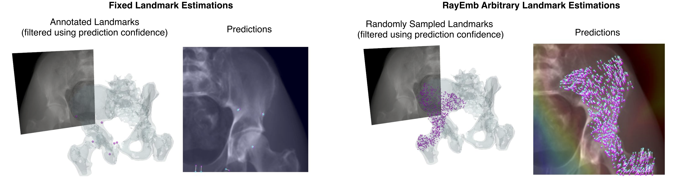

<div align="center">    
 
# RayEmb 
Arbitrary Landmark Detection in X-Ray Images Using Ray Embedding Subspace   

[](https://arxiv.org/abs/2410.08152)
[](https://accv2024.org/)
[](https://pragyanstha.github.io/rayemb/)

<!-- 
 -->

<!--  
Conference   
-->   
</div>


Comparison of landmark detection results between conventional fixed landmark
estimation and our arbitrary landmark estimation method. The 3D landmarks are
shown in magenta on the left, while the estimated 2D landmarks are displayed in
cyan and the ground truth in magenta on the right. Our method can generate a large
number of corresponding pairs of 3D landmarks and 2D projections, whereas the fixed
landmark estimation approach is limited to the pre-annotated landmarks.

## Overview

RayEmb introduces a novel approach for detecting arbitrary landmarks in X-ray images using ray embedding subspace. Our approach represents 3D points as distinct subspaces, formed by feature vectors (referred to as ray embeddings) corresponding to intersecting rays.
Establishing 2D-3D correspondences then becomes a task of finding ray embeddings that are close to a given subspace, essentially performing an intersection test.  

## Features

- A CLI for downloading data, preprocessing, training and evaluating models.
- A PyTorch implementation of the RayEmb and FixedLandmark models.
- [OpenCV](https://docs.opencv.org/4.x/d9/d0c/group__calib3d.html#ga549c2075fac14829ff4a58bc9317d6a9) based PnP + RANSAC based 2D-3D registration for initial pose estimates
- [DiffDRR](https://github.com/eigenvivek/DiffDRR) based refinement module.

## Requirements

- Python 3.10+
- PyTorch 2.0+
- CUDA 11.8+
We have tested the code on a RTX 3090 and an H100 GPU.

## Installation and Setup
Install the dependencies using poetry.
```bash
poetry install
```
Check that rayemb-cli is in your path and is executable.
```bash
rayemb --help
```
```
Usage: rayemb [OPTIONS] COMMAND [ARGS]...

Options:
  --help  Show this message and exit.

Commands:
  evaluate
  generate
  train
```

Download the original DeepFluoro dataset (only the real x-raysfor testing) using the following command:
```bash
rayemb download deepfluoro \
--data_dir ./data
```
Preprocess the DeepFluoro dataset to get the templates using the following command:
```bash
sh scripts/generate/template_deepfluoro.sh
```
Download the RayEmb-CTPelvic1k checkpoint using the following command:
```bash
rayemb download checkpoint \
--checkpoint_dir ./checkpoints \
--model rayemb \
--dataset ctpelvic1k
```
This can be used to evaluate the model on the CTPelvic1k dataset as well as DeepFluoro dataset.

## Evaluation
```bash
rayemb evaluate arbitrary-landmark deepfluoro \
--checkpoint_path ./checkpoints/rayemb-ctpelvic1k.ckpt \
--num_templates 4 \
--image_size 224 \
--template_dir ./data/deepfluoro_templates \
--data_dir ./data/ipcai_2020_full_res_data.h5
```

## Plans
- Update the readme for training, synthetic data generation and template generation.
- Update the readme for the synthetic CTPelvic1k dataset.
- Add typing and annotations to the codebase.

## Contact

For any questions or collaboration inquiries, please contact shrestha.pragyan@image.iit.tsukuba.ac.jp.

## Acknowledgements

We would like to thank [eigenvivek](https://github.com/eigenvivek) for his awesome [DiffDRR](https://github.com/eigenvivek/DiffDRR) codebase.

## Citations
If you find our work helpful for your research, please consider citing the following BibTeX entry.
```
@InProceedings{Shrestha_2024_ACCV,
    author    = {Shrestha, Pragyan and Xie, Chun and Yoshii, Yuichi and Kitahara, Itaru},
    title     = {RayEmb: Arbitrary Landmark Detection in X-Ray Images Using Ray Embedding Subspace},
    booktitle = {Proceedings of the Asian Conference on Computer Vision (ACCV)},
    month     = {December},
    year      = {2024},
    pages     = {665-681}
}
```
